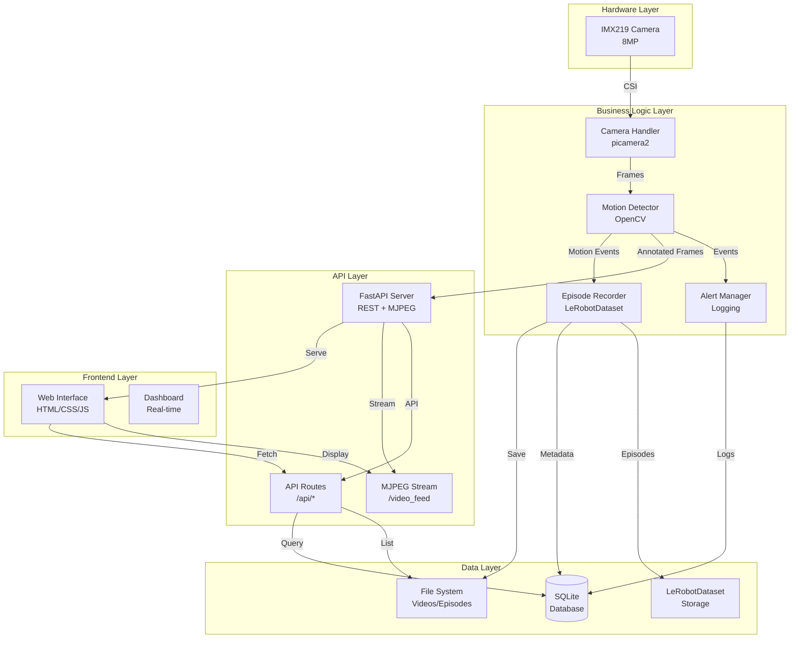
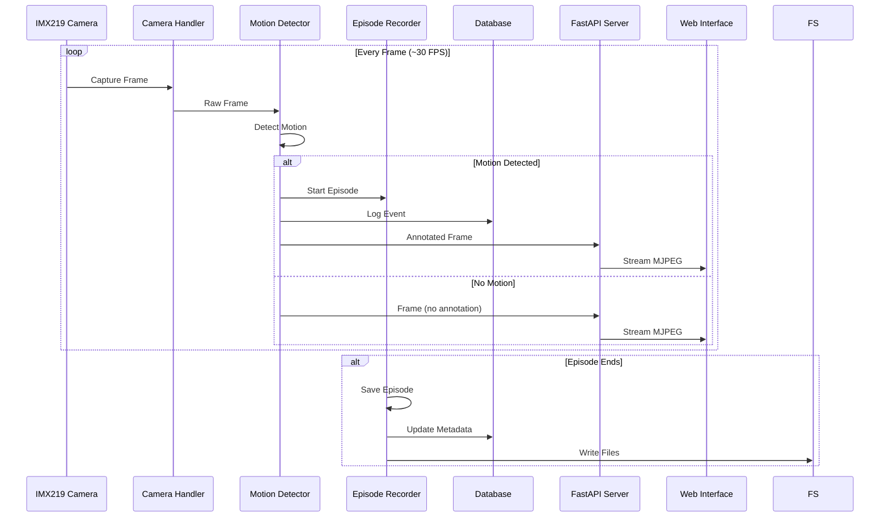

# Diseño Técnico - Sistema de Seguridad Inteligente

## Documento de Diseño (AI-DLC - Fase 2: Construction)

**Versión**: 1.0  
**Fecha**: 2025-01-15  
**Estado**: Aprobado para implementación

---

## 1. Arquitectura del Sistema

### 1.1 Diagrama de Componentes



### 1.2 Flujo de Datos Principal



---

## 2. Stack Tecnológico

### 2.1 Backend

| Componente | Tecnología | Versión | Razón |
|------------|-----------|---------|-------|
| Framework Web | FastAPI | 0.100.0+ | Async nativo, documentación automática |
| Servidor ASGI | Uvicorn | 0.23.0+ | Alto rendimiento, compatible FastAPI |
| Control Cámara | picamera2 | 0.3.12+ | API moderna, soporte oficial Pi |
| Visión | OpenCV | 4.8.0+ | Estándar industria, optimizado |
| Base de Datos | SQLite | 3.40+ | Sin servidor, fácil setup |
| ML/Datos | LeRobot | 2.0.0+ | Formato estándar robótica |
| Configuración | PyYAML | 6.0+ | Lectura de config YAML |

### 2.2 Frontend

| Componente | Tecnología | Versión | Razón |
|------------|-----------|---------|-------|
| HTML | HTML5 | - | Semántico, accesible |
| CSS | CSS3 | - | Grid, Flexbox, responsive |
| JavaScript | ES6+ | - | Vanilla (sin frameworks) |
| Streaming | MJPEG | - | Compatible navegadores |

### 2.3 Sistema Operativo

- **OS**: Raspberry Pi OS (64-bit)
- **Python**: 3.9+
- **Kernel**: Linux 6.1+

---

## 3. Estructura de Módulos

### 3.1 Organización de Carpetas

```
src/
├── __init__.py
├── main.py                    # Entry point principal
├── camera/
│   ├── __init__.py
│   └── imx219_handler.py      # Manejo de cámara IMX219
├── detection/
│   ├── __init__.py
│   └── motion_detector.py    # Algoritmo detección movimiento
├── database/
│   ├── __init__.py
│   └── db_manager.py          # Gestión SQLite
├── data/
│   ├── __init__.py
│   └── lerobot_dataset.py     # Integración LeRobotDataset
├── web/
│   ├── __init__.py
│   ├── camera_server.py       # Servidor FastAPI principal
│   ├── routes.py              # Endpoints API REST
│   ├── templates/
│   │   └── index.html         # Template HTML principal
│   └── static/
│       ├── css/
│       │   └── style.css      # Estilos
│       └── js/
│           └── app.js         # JavaScript frontend
└── alerts/
    ├── __init__.py
    └── notification.py        # Sistema de alertas/logs
```

### 3.2 Responsabilidades por Módulo

#### `camera/imx219_handler.py`
- Inicialización de cámara con picamera2
- Captura de frames en formato RGB
- Manejo de errores de hardware
- Configuración de resolución y framerate

#### `detection/motion_detector.py`
- Algoritmo de diferencia de frames
- Detección de contornos
- Anotación visual de movimiento
- Actualización adaptativa de fondo

#### `database/db_manager.py`
- Creación e inicialización de BD SQLite
- CRUD de episodios
- Registro de eventos
- Consultas con filtros

#### `data/lerobot_dataset.py`
- Creación de estructura LeRobotDataset
- Guardado de episodios
- Metadatos estructurados
- Organización por carpetas

#### `web/camera_server.py`
- Aplicación FastAPI principal
- Streaming MJPEG
- Integración de componentes
- Manejo de threads

#### `web/routes.py`
- Endpoints REST API
- Validación de inputs
- Respuestas JSON
- Manejo de errores HTTP

#### `alerts/notification.py`
- Sistema de logging estructurado
- Registro de eventos
- Niveles de severidad

---

## 4. Modelos de Datos

### 4.1 Esquema de Base de Datos

#### Tabla: `episodes`

| Columna | Tipo | Descripción |
|---------|------|-------------|
| id | INTEGER PRIMARY KEY | ID único del episodio |
| episode_id | TEXT UNIQUE | ID legible (ep_YYYYMMDD_HHMMSS) |
| file_path | TEXT | Ruta al archivo/episodio |
| start_time | TIMESTAMP | Inicio del episodio |
| end_time | TIMESTAMP | Fin del episodio (NULL si activo) |
| duration_seconds | REAL | Duración en segundos |
| motion_detected | BOOLEAN | Si hubo movimiento |
| object_detected | TEXT | JSON array de objetos detectados |
| confidence_score | REAL | Score de confianza (0-1) |
| created_at | TIMESTAMP | Fecha de creación del registro |
| metadata_json | TEXT | JSON adicional flexible |

**Índices**:
- `idx_episodes_time` en `start_time`
- `idx_episodes_motion` en `motion_detected`

#### Tabla: `events`

| Columna | Tipo | Descripción |
|---------|------|-------------|
| id | INTEGER PRIMARY KEY | ID único del evento |
| event_type | TEXT | Tipo (motion, episode_started, etc.) |
| timestamp | TIMESTAMP | Cuándo ocurrió |
| episode_id | INTEGER | FK a episodes (NULL si no aplica) |
| message | TEXT | Mensaje descriptivo |
| severity | TEXT | info, warning, error, critical |

**Índices**:
- `idx_events_time` en `timestamp`
- `idx_events_type` en `event_type`

#### Tabla: `models`

| Columna | Tipo | Descripción |
|---------|------|-------------|
| id | INTEGER PRIMARY KEY | ID único del modelo |
| model_name | TEXT | Nombre del modelo |
| version | TEXT | Versión (semver) |
| file_path | TEXT | Ruta al archivo del modelo |
| trained_at | TIMESTAMP | Cuándo se entrenó |
| dataset_used | TEXT | Dataset usado |
| accuracy | REAL | Precisión (0-1) |
| precision_score | REAL | Precision score |
| recall_score | REAL | Recall score |
| training_params_json | TEXT | JSON con hiperparámetros |
| created_at | TIMESTAMP | Fecha de creación |

**Constraints**:
- UNIQUE(model_name, version)

#### Tabla: `training_runs`

| Columna | Tipo | Descripción |
|---------|------|-------------|
| id | INTEGER PRIMARY KEY | ID único |
| model_id | INTEGER | FK a models |
| started_at | TIMESTAMP | Inicio del entrenamiento |
| completed_at | TIMESTAMP | Fin (NULL si en progreso) |
| status | TEXT | running, completed, failed |
| epochs | INTEGER | Número de épocas |
| loss | REAL | Loss final |
| validation_loss | REAL | Validation loss |
| notes | TEXT | Notas adicionales |

### 4.2 Modelos Pydantic (API)

```python
from pydantic import BaseModel
from datetime import datetime
from typing import Optional, List

class EpisodeResponse(BaseModel):
    id: int
    episode_id: str
    file_path: str
    start_time: datetime
    end_time: Optional[datetime]
    duration_seconds: Optional[float]
    motion_detected: bool
    object_detected: Optional[List[str]]
    
class EventResponse(BaseModel):
    id: int
    event_type: str
    timestamp: datetime
    episode_id: Optional[int]
    message: str
    severity: str

class StatusResponse(BaseModel):
    camera_active: bool
    motion_detected: bool
    fps: float
    total_episodes: int
    total_events: int
    uptime_seconds: float

class ConfigUpdate(BaseModel):
    motion_threshold: Optional[int]
    min_area: Optional[int]
    background_update_rate: Optional[float]
```

---

## 5. APIs Principales

### 5.1 Endpoints REST

#### `GET /`
- **Descripción**: Página principal con interfaz web
- **Respuesta**: HTML (template)
- **Autenticación**: No requerida (Fase 1)

#### `GET /video_feed`
- **Descripción**: Stream MJPEG de video en tiempo real
- **Respuesta**: `multipart/x-mixed-replace` (MJPEG)
- **Headers**: `Content-Type: multipart/x-mixed-replace; boundary=frame`
- **Autenticación**: No requerida

#### `GET /api/episodes`
- **Descripción**: Lista de episodios con filtros
- **Query Params**:
  - `start_date` (opcional): ISO format timestamp
  - `end_date` (opcional): ISO format timestamp
  - `motion_only` (opcional): boolean
  - `limit` (opcional): int (default: 100)
- **Respuesta**: JSON array de `EpisodeResponse`
- **Ejemplo**: `/api/episodes?motion_only=true&limit=10`

#### `GET /api/events`
- **Descripción**: Eventos recientes del sistema
- **Query Params**:
  - `limit` (opcional): int (default: 50)
  - `event_type` (opcional): string
  - `severity` (opcional): string
- **Respuesta**: JSON array de `EventResponse`

#### `GET /api/status`
- **Descripción**: Estado actual del sistema
- **Respuesta**: JSON `StatusResponse`
- **Uso**: Para actualización automática del dashboard

#### `POST /api/config`
- **Descripción**: Actualizar configuración del sistema
- **Body**: JSON `ConfigUpdate`
- **Respuesta**: JSON con confirmación
- **Validación**: Validar rangos de valores

#### `GET /docs`
- **Descripción**: Documentación automática Swagger UI
- **Generado por**: FastAPI automáticamente

### 5.2 Flujo de Streaming MJPEG

```python
async def generate_frames():
    """Generador async de frames MJPEG."""
    while True:
        frame = get_current_frame()  # Thread-safe
        if frame is not None:
            ret, buffer = cv2.imencode('.jpg', frame, 
                                      [cv2.IMWRITE_JPEG_QUALITY, 85])
            if ret:
                yield (b'--frame\r\n'
                       b'Content-Type: image/jpeg\r\n\r\n' + 
                       buffer.tobytes() + b'\r\n')
        await asyncio.sleep(0.033)  # ~30 FPS
```

---

## 6. Interfaz Web

### 6.1 Diseño del Dashboard

**Layout**:
```
┌─────────────────────────────────────────┐
│  Header: Pi Camera Security System      │
├─────────────────────────────────────────┤
│  ┌──────────────┐  ┌────────────────┐ │
│  │              │  │  Status Panel    │ │
│  │              │  │  - Motion: ON   │ │
│  │  Video       │  │  - Count: 42    │ │
│  │  Stream      │  │  - FPS: 28.5    │ │
│  │  (MJPEG)     │  │  - Uptime: 2h   │ │
│  │              │  └────────────────┘ │
│  └──────────────┘                      │
├─────────────────────────────────────────┤
│  Recent Episodes                         │
│  ┌────────────────────────────────────┐ │
│  │ Episode 001 - 2025-01-15 14:30:22 │ │
│  │ Episode 002 - 2025-01-15 14:25:10 │ │
│  └────────────────────────────────────┘ │
├─────────────────────────────────────────┤
│  Configuration                          │
│  ┌────────────────────────────────────┐ │
│  │ Motion Threshold: [30]  [Update]     │ │
│  │ Min Area:        [500] [Update]    │ │
│  └────────────────────────────────────┘ │
└─────────────────────────────────────────┘
```

### 6.2 Componentes Frontend

#### HTML Structure
- Header con título
- Sección de video stream (``)
- Panel de estado (actualizado vía JavaScript)
- Lista de episodios (fetch desde API)
- Panel de configuración (formulario)

#### CSS Features
- **Mobile-first**: Diseño responsive
- **Grid Layout**: Para organización
- **Dark Theme**: Tema oscuro por defecto
- **Animations**: Transiciones suaves
- **Colors**: Verde para "calmado", rojo para "movimiento"

#### JavaScript Functionality
- **Auto-refresh**: Actualizar estado cada 1 segundo
- **Event Listeners**: Para formularios y controles
- **Error Handling**: Manejo de errores de conexión
- **Visual Feedback**: Indicadores de estado

### 6.3 Responsive Design

**Breakpoints**:
- Mobile: < 768px (stack vertical)
- Tablet: 768px - 1024px (2 columnas)
- Desktop: > 1024px (layout completo)

---

## 7. Algoritmo de Detección de Movimiento

### 7.1 Proceso

1. **Captura de Frame**: Obtener frame RGB de cámara
2. **Conversión a Gris**: `cv2.cvtColor(frame, cv2.COLOR_RGB2GRAY)`
3. **Blur Gaussiano**: Reducir ruido (`kernel_size=21`)
4. **Diferencia con Fondo**: `cv2.absdiff(background, current_frame)`
5. **Threshold**: Binarizar diferencia (`threshold=30`)
6. **Dilatación**: Conectar áreas cercanas
7. **Detección de Contornos**: `cv2.findContours()`
8. **Filtrado por Área**: Descartar contornos < `min_area`
9. **Anotación**: Dibujar rectángulos en áreas de movimiento

### 7.2 Actualización de Fondo

**Estrategia**: Actualización adaptativa
- Fondo inicial: Primer frame capturado
- Actualización: `background = (1-α) * background + α * current_frame`
- `α = 0.1` (configurable)

### 7.3 Optimizaciones para Raspberry Pi

- Reducir resolución si es necesario (1920x1080 → 1280x720)
- Usar `cv2.UMat` para aceleración GPU (si disponible)
- Procesar cada 2 frames (15 FPS efectivo)
- Blur kernel pequeño (21x21 máximo)

---

## 8. Integración con LeRobotDataset

### 8.1 Estructura de Episodio

```
data/episodes/
└── episode_001/
    ├── images/
    │   ├── frame_000000.jpg
    │   ├── frame_000001.jpg
    │   └── ...
    ├── metadata.json
    └── info.json
```

### 8.2 Formato metadata.json

```json
{
  "episode_id": "episode_001",
  "start_time": "2025-01-15T14:30:22Z",
  "end_time": "2025-01-15T14:30:45Z",
  "duration_seconds": 23.0,
  "fps": 30,
  "motion_detected": true,
  "total_frames": 690,
  "resolution": {
    "width": 1920,
    "height": 1080
  }
}
```

---

## 9. Configuración del Sistema

### 9.1 Archivo `config/camera_config.yaml`

```yaml
camera:
  resolution:
    width: 1920
    height: 1080
  framerate: 30
  format: "RGB888"

detection:
  motion_threshold: 30
  min_area: 500
  blur_kernel: 5
  background_update_rate: 0.1

storage:
  save_path: "./data/videos"
  episode_path: "./data/episodes"
  save_on_motion: true
  max_episode_duration: 300  # segundos

database:
  db_path: "./data/database.db"

web:
  host: "0.0.0.0"
  port: 5000
  debug: false
```

### 9.2 Variables de Entorno (`.env`)

```env
# Opcional en Fase 1
LOG_LEVEL=INFO
MAX_EPISODES=1000
```

---

## 10. Decisiones de Diseño

### 10.1 FastAPI sobre Flask

**Razón**: 
- Mejor rendimiento async
- Type hints nativos
- Documentación automática
- Mejor para streaming

### 10.2 SQLite sobre PostgreSQL

**Razón**:
- Sin servidor adicional
- Suficiente para fase inicial
- Fácil migración futura

### 10.3 Vanilla JavaScript sobre Frameworks

**Razón**:
- Menor overhead
- Más rápido en Raspberry Pi
- Sin dependencias adicionales
- Suficiente para funcionalidad requerida

### 10.4 MJPEG sobre HLS/WebRTC

**Razón**:
- Compatible con todos los navegadores
- Implementación simple
- Baja latencia
- Suficiente para uso local

---

## 11. Seguridad (Fase 1)

### 11.1 Medidas Implementadas

- Validación de inputs en API
- Manejo seguro de errores (no exponer información sensible)
- Paths relativos (no absolutos)
- Sanitización de paths de archivos

### 11.2 No Implementado (Futuras Fases)

- Autenticación web
- HTTPS/TLS
- Rate limiting
- CORS restrictivo

---

## 12. Escalabilidad Futura

### 12.1 Preparación para Crecimiento

- Arquitectura modular permite añadir módulos
- Base de datos diseñada para múltiples cámaras
- API REST permite integración con otros sistemas
- LeRobotDataset preparado para ML

### 12.2 Mejoras Futuras

- Reconocimiento de objetos (YOLO, MobileNet)
- Múltiples cámaras simultáneas
- Almacenamiento en nube
- Alertas por email/SMS
- Dashboard avanzado con gráficos

---

## 13. Referencias

- **Requirements**: `docs/inception/requirements.md`
- **Steering File**: `docs/steering/ai-steering.md`
- **AI-DLC Methodology**: `AIDLC.pdf`
- **FastAPI Docs**: https://fastapi.tiangolo.com/
- **picamera2 Docs**: https://datasheets.raspberrypi.com/camera/picamera2-manual.pdf
- **LeRobotDataset**: https://huggingface.co/docs/lerobot

---

**Aprobado para Implementación**: 2025-01-15  
**Versión**: 1.0
